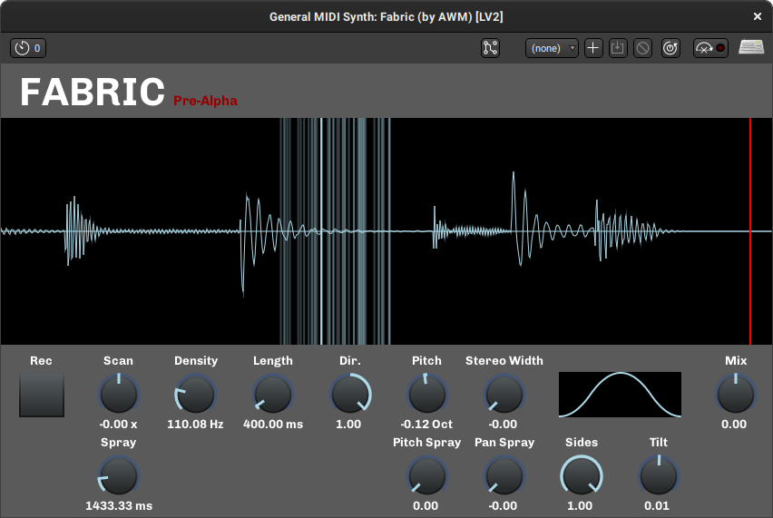

# Fabric

#### Fabric Delay Line Granular Effect

Fabric is currently being developed, and is subject to radical changes. 
Use at own risk during this time. 

### Current Development Screenshot:


### Build (Linux only currently):

First checkout the repo & grab DPF submodule:
```
git clone https://github.com/alcomposer/fabric
git submodule update --init --recursive
```

Make a build folder:
```
mkdir build
cd build
```

Then inside build folder use cmake:
```
cmake ..
make
```

If everything went well, you will then have a folder called `bin` which contains:
```
fabric
fabric.lv2
fabric-vst2.so
```
